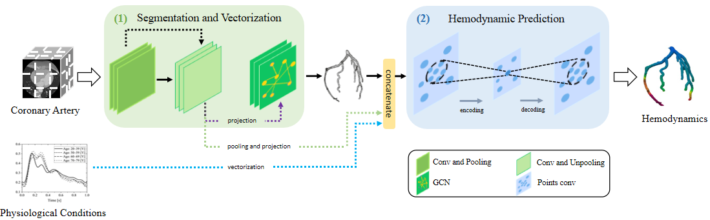

# Voxel2Hemodynamics
# Introduction
This is the repo of the STACOM2023 paper Voxel2Hemodynamics: An End-to-end Deep Learning Method for Predicting Coronary Artery Hemodynamics.

# Content 
This repo contains an end to end framework to get the hemodynamics prediction of coronary artery given a dcm image. First we
generate pointcloud data from dcm and then use pointnet++ to predict the hemodynamics. Here are only part of the code for the 
paper and this repo is still being updated.
# Setup
```
cd Voxel2Hemodynamics
pip install -r requirement.txt
```
# Directory Structure
```
Voxel2Hemodynamic
├── checkpoints (please download the weight and create this directory yourself)
├── data
    ├── test_data
├── data_utils
├── README.md
├── models
    ├── pointnet2_sem_seg.py(point cloud module)
├── DDP_test.sh
├── config-predict.yaml
└── mtools(segmentation and vectorization module)
```
# Visualization 
After the prediction, the visualization result of the prediction can be get using the software Paraview
the link for download this software is: https://www.paraview.org/
